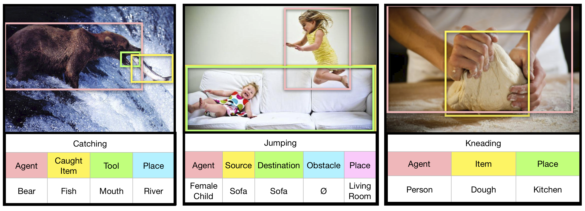

 ## Overview

This repository contains the Situation With Groundings (SWiG) dataset as
 well as code to train and run inference on the Joint Situation Localizer (JSL).
 This is a model which solves the Grounded Situation Recognition (GSR) task. The SWiG
 dataset, JSL model, and the GSR task are all detailed in https://arxiv.org/abs/2003.12058.
 This document details how to
 1. Download the SWiG dataset
 2. Run inference on JSL
 3. Train JSL
 
 
 If you are only planning to use the SWiG dataset, clone/download the repository and read the 
 instrucitons in section 1 of this document. If you are planning on running JSL on SWiG or your own dataset
 , clone/download the repository and install the requirements using the below steps 
 (or whatever process you typically use).
 
  ``` 
  git clone git@github.com:allenai/swig.git   # Clone repository
cd swig                                     # Navigate into repository
python3 -m venv my_venv                     # Create virtual enviornment with python 3
source my_venv/bin/activate                 # Activate virtual enviornment
pip install -r requirements.txt             # Install requirements from requirements file
  ```
 
 
 ## 1. SWiG Dataset
 
 TLDR: JSON files are under SWiG_jsons. Images can be downloaded [here](https://swig-data-weights.s3.us-east-2.amazonaws.com/images_512.zip).
 
 
  
  
  Each image in the SWiG dataset is associated with 3 pieces of information. Verb, frame and grounding.
  
  (a) Verb:
each image is associated with one of 504 visually groundable verbs (one
in which it is possible to view the action, for example, talking is visible, but
thinking is not). 

(b) Frame: this consists of 1 to 6 semantic role values i.e. nouns
associated with the verb (each verb has its own pre-defined set of roles). For example, the l
final image in the above figure consists of the verb "kneading" and the roles "Agent", "Item", 
and "Place".
Every image labeled with the verb kneading will have the same roles but may have
different nouns filled in at each role based on the contents of the image. A role
value can also be ∅ indicating that a role does not exist in an image (such as the 
obstacle in the second image). The SWiG dataset has 3 nouns for each role given by 3 different annotators.


(c) Groundings: each grounding is described with coordinates [x1, y1, x2, y2] if
the noun in grounded in the image. It is possible for a noun to be labeled in the
frame but not grounded, for example in cases of occlusion.

This information is stored in a JSON format for train, test and dev. There is one entry per image, which 
contains 'verb', 'frames' and 'bb', as well as the height and width of the image. 'bb' describes 
the location of each object (where [-1, -1, -1, -1] means no grounding). Frames contains all 3 sets of
annotations, where each set has a label for each role corresponding to that verb. Below is an example annotation
for one image.   

```
"hitchhiking_238.jpg": {
"verb": "hitchhiking", 
"height": 683, 
"width": 512, 
"bb": {"place": [-1, -1, -1, -1], "agent": [195, 282, 380, 554]}, 
"frames": [{"place": "n03519981", "agent": "n10287213"}, 
            {"place": "n03519981", "agent": "n10287213"}, 
            {"place": "n04096066", "agent": "n10287213"}]
}
```

Additionally, more information about the nouns and verbs can be found in imsitu_space.json. The "nouns" index of this 
JSON contains all of the nouns used in this dataset, as well as definitions or glosses for these words. The glosses are 
all the english words used to describe the wordnet concept. Below is an example of the information for one noun:
```
"n10787470": {
"gloss": ["woman", "adult female"], 
"def": "an adult female person (as opposed to a man)"
}
```

The "verbs" index of imsitu_space.json has additional information for each verb used in the dataset. This includes a 
framenet category, a definition of the verb, a sentence template containing each role, the order these roles appear in the sentence
and a description of each role. Below is an example of the information for one verb:

```
"drinking": {
"framenet": "Ingestion", 
"abstract": "the AGENT drinks a LIQUID from a CONTAINER at a PLACE", 
"def": "take (a liquid) into the mouth and swallow", 
"order": ["agent", "liquid", "container", "place"], 
"roles": {"place": {"framenet": "place", "def": "The location where the drink event is happening"}, 
        "container": {"framenet": "source", "def": "The container in which the liquid is in"}, 
        "liquid": {"framenet": "ingestibles", "def": "The entity that the agent is drinking"}, 
        "agent": {"framenet": "ingestor", "def": "The entity doing the drink action"}}
}
```
Imsitu_Space, Train, Dev and Test JSONS can be found in the SWiG_jsons directory of this repository. 
Images can be downloaded [here](https://swig-data-weights.s3.us-east-2.amazonaws.com/images_512.zip).

 
 
  ## 2. Inference on  JSL
  
  To run inference on a set of custom images first download or clone this repository and download the 
  images using the steps detailed above. Additionally, you will need a set of verb classification weights and a
  set of weights for the primary noun/detection portion of the model. You can use your own weights or you can
 use these weights from the original paper. You will also need to specify what images you want the model
 to processes. You can specify this wil a text file where each line of the file contains the path to one 
 image. All images should have a unique name. You can then run inference by navigating into the primary folder and running:
 
 ```python ./JSL/inference.py --verb-path ./path/to/verb/weights --jsl-path ./path/to/detection/weights --image-file ./path/to/images --batch-size batch_size```
 
  Results will be written to results.json which will contain a prediction for each role in the image and a grounding for each prediction 
  (groundings may be null). Additionally, you can use the ```--store-features``` flag which will write the local ResNet features for each object to and
  hdf5. When no grounding is predict, it just uses the features for the entire image.  
  
  
  Weights for models described in the paper can be downloaded [here](https://swig-data-weights.s3.us-east-2.amazonaws.com/weights.zip)
  
   ## 3. Training JSL
   
   We have seperated the training of JSL into training the verb prediction portion of the model and then training the 
   primary noun and detection portion of the model. These portions only need to be combined at evalutation so we seperate them out
   to allow for greater flexibility adjusting these models in the future.  
   
   All of the code for training the verb classifier is under ./JSL/verb. All model checkpoints and tensorboard events are saved in ./JSL/verb/runs. 
   Train the verb classifier by running the below command from the main folder.
   
   ```python ./JSL/verb/main.py```
   
   
   All of the code for training the detection and classification is under ./JSL/gsr with some file in ./global_utils. All model checkpoints and tensorboard events are saved in ./JSL/gsr/runs. 
   Additionally, you must specify the SWiG train file and val file using the corresponding flags. You must also specify a class file, such as the file 'train_classes.csv' which indicates all training
   classes. Any noun in either the train file or the val file not specified in this csv will be considered out of vocabulary. Use the below command and flags to specify these files
   and train your model.
   
   ```python ./JSL/gsr/train.py --train-file ./SWiG_jsons/train.json --val-file ./SWiG_jsons/dev.json --classes-file ./global_utils/train_classes.csv --batch-size batch_size```
 

  ## 4. Citing
  If you find this project useful in your research, please consider citing:


  ``` 
  @article{Pratt2020Swig,
  title={Grounded Situation Recognition},
  author={Sarah Pratt and Mark Yatskar and Luca Weihs and Ali Farhadi and Aniruddha Kembhavi},
  journal={ArXiv},
  year={2020},
  volume={abs/2003.12058}
  }
  ```